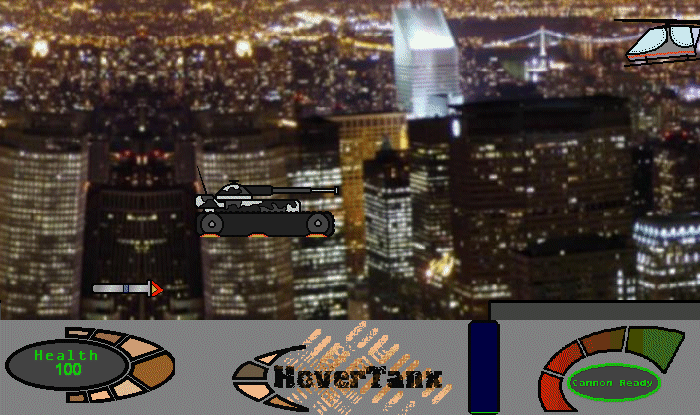



## An Advanced 2D Sidescrolling Game \- Hover Tanx  Verison 1\.2

### Description

Hover Tanx is a 2D sidescrolling game complete with 14 levels, 6 cinematics, many differnent tanks, enemies and bosses and a level editor. The game is done in straightforward BitBlt, demonstrates how to use midis, file I/O for levels, and lots more. It's very fun to play and quite challenging. Commented rather thoroughly for beginners. Sorry for the large file size, but it's an ENTIRE GAMe. Please vote and give feedback. View my other games at www.doc-ent.com
 
### More Info
 
Put the jpeg files that are numbers into a new directory called Cinema.

             |
---                |---
**Submitted On**   |2005-05-14 13:55:16
**By**             |[Michael Bentley](https://github.com/Planet-Source-Code/PSCIndex/blob/master/ByAuthor/michael-bentley.md)
**Level**          |Advanced
**User Rating**    |4.5 (18 globes from 4 users)
**Compatibility**  |VB 6\.0
**Category**       |[Games](https://github.com/Planet-Source-Code/PSCIndex/blob/master/ByCategory/games__1-38.md)
**World**          |[Visual Basic](https://github.com/Planet-Source-Code/PSCIndex/blob/master/ByWorld/visual-basic.md)
**Archive File**   |[aaa\_\-\_Hove1888265142005\.zip](https://github.com/Planet-Source-Code/michael-bentley-an-advanced-2d-sidescrolling-game-hover-tanx-verison-1-2__1-60529/archive/master.zip)

